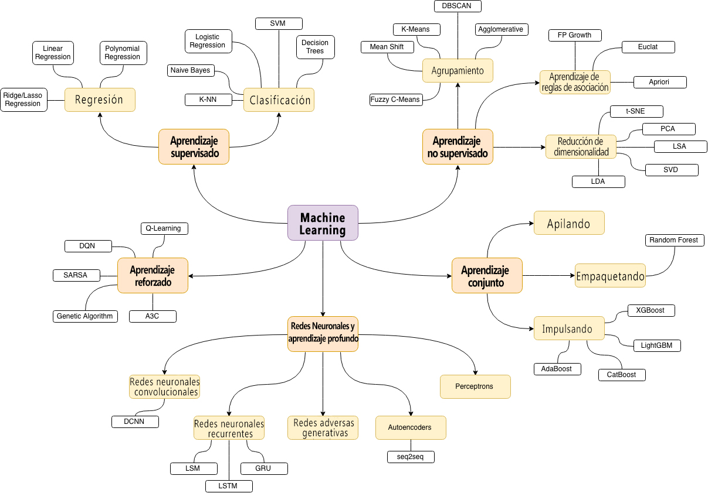

#  This an merge conflict by Tavo Merge Conflict
# Machine Learning en MatLab/Octave con interfaz grafica

> _Para la version original de Python/Jupyter puedes visitar el siguiente enlace [homemade-machine-learning](https://github.com/trekhleb/homemade-machine-learning)._

Este repositorio contiene ejemplos en MatLab/Octave de algoritmos populares de machine learning con las matematicas detras de estos explicadas.

El propósito de este repositorio era para _no_ implementar algoritmos de Machine Learning utilizando bibliotecas de 3rd en Octave/MatLab "de una sola línea", con el _proposito_ de practicar y entender mejor las matemáticas detrás de cada algoritmo. En la mayoría de los casos, las explicaciones se basan en este [curso](https://www.coursera.org/learn/machine-learning) de Machine Learning.

## Aprendizaje Supervisado 

En el aprendizaje supervisado tenemos un conjunto de datos de entrenamiento como una entrada y un conjunto de etiquetas o "respuestas correctas" para cada conjunto de entrenamiento como una salida. Luego, estamos entrenando a nuestro algoritmo (parámetros del algoritmo de Machine Learning) para asignar la entrada a la salida correctamente (para hacer la predicción correcta). El propósito final es encontrar dichos parámetros del algoritmo que continuarán con éxito entrada → mapeo de salida (predicciones) incluso para los nuevos ejemplos de entrada.

### Regresión

En problemas de regresión hacemos predicciones de valor real. Básicamente tratamos de dibujar un plano de línea/plano/n-dimensional a lo largo de los ejemplos de entrenamiento.

_Ejemplos: previsión del precio de las acciones, análisis de ventas, dependencia de cualquier número, etc._

🤖 [Regresion Lineal](./linear-regression) - ejemplo: predicción de precios de viviendas.

### Clasificación

En los problemas de clasificación dividimos los ejemplos de entrada por ciertas características.

_Ejemplos: filtros de spam, detección de idioma, búsqueda de documentos similares, reconocimiento de letras escritas a mano, etc._

🤖 [Regresion Logistica](./logistic-regression) _ejemplos: detección de la condición física de los microchips, reconocimiento de letras escritas a mano usando el enfoque de uno contra todos._

## Aprendizaje sin supervisión

El aprendizaje sin supervisado es una rama del Machine Learning que aprende de datos de pruebas que no se han etiquetado, clasificado o categorizado. En lugar de responder a la retroalimentación, el aprendizaje no supervisado identifica puntos en común en los datos y reacciona en función de la presencia o ausencia de tales puntos en común en cada nueva pieza de datos.

### Agrupamiento

En problemas de agrupamiento dividimos los ejemplos de entrenamiento por características desconocidas. El algoritmo mismo decide qué característica usar para la división.

_Ejemplos: segmentación del mercado, análisis de redes sociales, organización de clusters de computación, análisis de datos astronómicos, compresión de imágenes, etc._

🤖 [K-means algoritmo](./k-means) _ejemplo: dividir datos en tres grupos._

### Detección de anomalías

La detección de anomalías (también la detección de valores atípicos) es la identificación de elementos raros, eventos u observaciones que generan sospechas al diferir significativamente de la mayoría de los datos.

_Ejemplos: detección de intrusiones, detección de fraudes, monitoreo del estado del sistema, eliminación de datos anómalos del conjunto de datos, etc._

🤖 [Detección de anomalías mediante distribución gaussiana](./anomaly-detection) _ejemplo: detectar un servidor sobrecargado._

## Red neuronal (NN)

La red neuronal en sí no es un algoritmo, sino un marco para que muchos algoritmos de aprendizaje automático trabajen juntos y procesen entradas de datos complejos.

_Ejemplos: como sustituto de todos los demás algoritmos en general, reconocimiento de imágenes, reconocimiento de voz, procesamiento de imágenes (aplicando un estilo específico), traducción de idiomas, etc._

🤖 [Red neuronal: Perceptrón multicapa (MLP)](./neural-network) - ejemplo: reconocimiento de dígitos a mano.

## Mapa de aprendizaje automático

La fuente del anterior mapa de temas de aprendizaje automático es [esta publicacion en un blog](https://vas3k.ru/blog/machine_learning/)

## ¿Comó usar este repositorio? 

### Instalar MatLab

Este repositorio contiene `*.m` scripts que están destinados a ejecutarse en Octave o MatLab . Por lo tanto, para correr cualquier archivo, necesita que MatLab este instalado en su máquina local. En el caso de MatLab también puede utilizar su [versión web](https://matlab.mathworks.com/).

### Usar la interfaz grafica 

Para ejecutar el algoritmo de su elección, debe ir a la carpeta elegida por ejemplo: (`neural-network`), y debera identificar el `*.m` que contiene la interfaz grafica, son dos archivos con el mismo nombre pero diferente extención `*.m` y `*.fig` para el caso de `neural-network` sera `RedNeuronal.m` y `RedNeuronal.fig` y ejecutar el archivo ".m" el cual cargara la intefaz grafica 
