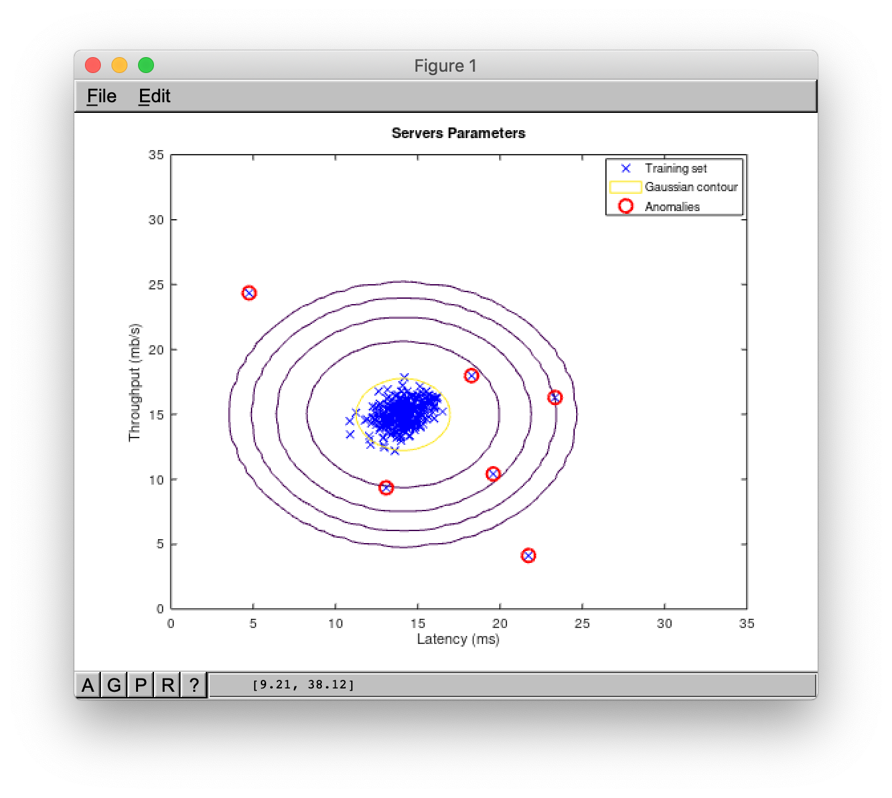

# Detección de anomalías mediante distribución gaussiana
## Distribución Gaussiana (Normal)

La **distribución normal** (o **Gaussiana** ) es una distribución de probabilidad continua muy común. Las distribuciones normales son importantes en las estadísticas y a menudo se usan en las ciencias naturales y sociales para representar variables aleatorias de valor real cuyas distribuciones no se conocen. Una variable aleatoria con una distribución gaussiana se dice que se distribuye normalmente y se llama desviación normal.

Digamos:

Si _x_ se distribuye normalmente, puede mostrarse de la siguiente manera.

 - valor medio,

 - varianza.

 - "~" significa que _"x se distribuye como ..."_

Luego, la distribución gaussiana (la probabilidad de que alguna _x_ sea ??parte de la distribución con cierta media y varianza) viene dada por:

## Estimando parámetros para un Gaussiano

We may use the following formulas to estimate Gaussian parameters (mean and variation) for _ith_ feature:

Podemos utilizar las siguientes fórmulas para calcular los parámetros de Gauss (media y variación) para _iésimo_ característica:

 - Número de ejemplos de entrenamiento.

 - Número de características.

## Estimación de densidad

Así que tenemos un conjunto de entrenamiento:

Suponemos que cada característica del conjunto de entrenamiento se distribuye normalmente:

Entonces:

## Anomaly Detection Algorithm

1. Elija las características  que puedan ser indicativas de ejemplos anómalos ().
2. Ajustar los parametros  utilizando las siguientes fórmulas:

3. Dado el nuevo ejemplo _x_, calcular _p(x)_:

Anomalía si 

 - umbral de probabilidad.

## Evaluación de algoritmos

El algoritmo puede ser evaluado usando el puntaje de F1 .

El puntaje de F1 es el promedio armónico de la precisión y el recuerdo, donde un puntaje de F1 alcanza su mejor valor en 1 (precisión perfecta y recordatorio) y el peor en 0.

Dónde:

_tp_ - número de verdaderos positivos.

_fp_ - número de falsos positivos.

_fn_ - número de falsos negativos.

## Archivos

- [demo.m](./demo.m) -  archivo principal que debe ejecutar desde la consola de Octave/MatLab para ver la demostración desde la consola.
- [server_params.mat](./server_params.mat) - conjunto de datos de entrenamiento.
- [estimate_gaussian.m](./estimate_gaussian.m) - esta función estima los parámetros de una distribución gaussiana usando los datos en X.
- [multivariate_gaussian.m](./multivariate_gaussian.m) - función que calcula la función de densidad de probabilidad de la distribución gaussiana multivariada.
- [select_threshold.m](./select_threshold.m) - función que encuentra el mejor umbral (épsilon) que se usará para seleccionar valores atípicos.
- [visualize_fit.m](./visualize_fit.m) - Función que visualiza el conjunto de datos y su distribución estimada.
- [anomalydetection.m](./anomalydetection.m) - archivo principal que debe ejecutar desde Octave/MatLab para usar el algoritmo desde el entorno grafico.
- [anomalydetection.fig](./anomalydetection.fig) - archivo que almacena los gráficos, que se utilizan para visualizar los datos.
- [printAD.fig](./printAD.fig) - archivo que contiene el formato de los resultados que imprime en los archivos .doc y .pdf.

### Visualizaciones de los resultados

## Referencias

- [Machine Learning en Coursera](https://www.coursera.org/learn/machine-learning)
- [Distribución normal en Wikipedia](https://es.wikipedia.org/wiki/Distribución_normal)
- [Valor F1 en Wikipedia](https://es.wikipedia.org/wiki/Valor-F)
  