# Algoritmo de K-medias

Tiene como objetivo dividir n observaciones en K clústeres en los que cada observación pertenece al clúster con la media más cercana, y sirve como prototipo del clúster.

El resultado de un análisis de grupo se muestra a continuación como la coloración de los cuadrados en tres grupos.

## Descripción

Dado un conjunto de observaciones formativas:

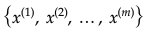

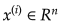

Donde cada observación es un vector real _d_- dimensional, el agrupamiento de k-means tiene como objetivo dividir las _m_ observaciones en _K_ ( _≤ m_ ) agrupamientos:

... para minimizar la suma de cuadrados dentro del grupo (es decir, la varianza).

A continuación puede encontrar un ejemplo de 4 inicializaciones aleatorias de centroides de clúster y convergencia adicional de clústeres:

[Fuente de la imagen](http://shabal.in/visuals/kmeans/6.html)

Otra ilustración de la convergencia de k-medias:

## Función de coste (distorsión)

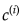 - índice del grupo _(1, 2, ..., K)_ al que está asignado actualmente el ejemplo _x(i).

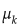 - cluster centroide _k_ (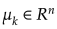) y 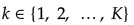.

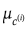 - centroide del clúster de un clúster al que se asignó el ejemplo _x(i)_.

Por ejemplo:

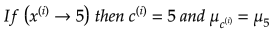

En este caso, el objetivo de optimización será el siguiente:

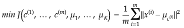

## El algoritmo

Inicialice aleatoriamente los centroides del grupo _K_ (elija ejemplos de entrenamiento de _K_ al azar y configure los centroides del grupo _K_ para esos ejemplos).

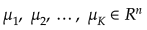

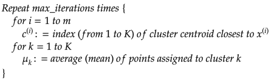

## Archivos

- [demo.m](./demo.m) - archivo de demostración en consola del algoritmo
- [set1.mat](./set1.mat) - conjunto de datos de entrenamiento # 1.
- [set2.mat](./set2.mat) - conjunto de datos de entrenamiento # 2.
- [compute_centroids.m](./compute_centroids.m) - calcula el siguiente centroide medio para cada grupo.
- [find_closest_centroids.m](./find_closest_centroids.m) - divide los ejemplos de entrenamiento en grupos según la distancia a los centroides.
- [init_centroids.m](./init_centroids.m) - inicia aleatoriamente los centroides tomando ejemplos de entrenamiento aleatorios.
- [k_means_train.m](./k_means_train.m) - función que ejecuta el algoritmo K-Means.
- [kmeans.m](./kmeans.m) - archivo principal que debe ejecutar desde Octave/MatLab para usar el algoritmo desde el entorno grafico.
- [kmeans.fig](./kmeans.fig) - archivo que almacena los gráficos, que se utilizan para visualizar los datos.
- [printKM.m](./printKM.m) - archivo que contiene el formato de los resultados que imprime en los archivos .doc y .pdf.

### Visualizaciones de demostración

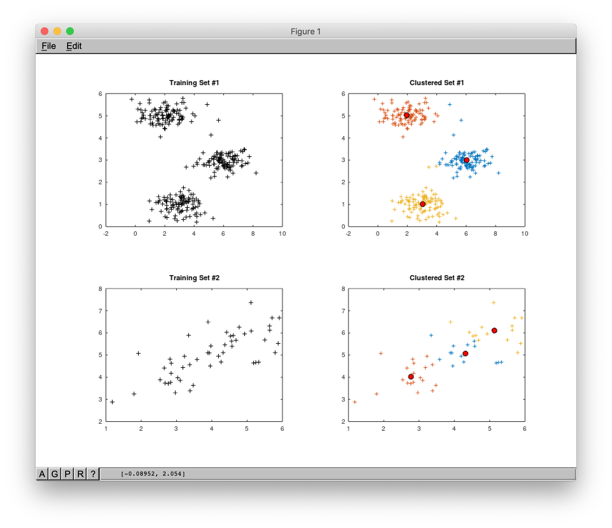

## Referencias

- [Machine Learning en Coursera](https://www.coursera.org/learn/machine-learning)
- [K-means en Wikipedia](https://es.wikipedia.org/wiki/K-medias)
