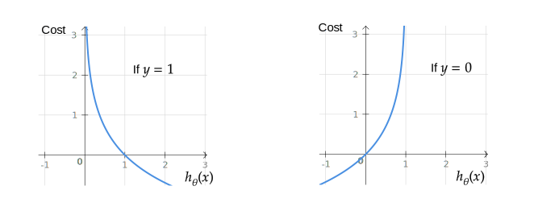

# Regresión logística

**La regresión logística** es el análisis de regresión apropiado para realizar cuando la variable dependiente es dicotómica (binaria). Como todos los análisis de regresión, la regresión logística es un análisis predictivo. La regresión logística se utiliza para describir datos y para explicar la relación entre una variable binaria dependiente y una o más variables independientes nominales, ordinales, de intervalo o de relación.

La regresión logística se utiliza cuando la variable dependiente (objetivo) es categórica.

Por ejemplo:

- Para predecir si un correo electrónico es spam (1) o (0).
- Si la transacción en línea es fraudulenta (1) o no (0).
- Si el tumor es maligno (1) o no (0).

En otras palabras, la variable dependiente (salida) para el modelo de regresión logística se puede describir como:

## Conjunto de entrenamiento

El conjunto de capacitación es un dato de entrada donde para cada conjunto predefinido de características _x_ tenemos una clasificación correcta _y_.

_m_ - número de ejemplos de conjuntos de entrenamiento.

Para mayor comodidad de la notación, defina:

## Hipótesis (El Modelo)

La ecuación que obtiene características y parámetros como una entrada y predice el valor como una salida (es decir, predice si el correo electrónico es spam o no según algunas características del correo electrónico).

Donde _g()_ es una **función sigmoide**.

Ahora nosotros escribimos la hipótesis de la siguiente manera:

## Función de costo

Función que muestra la precisión de las predicciones de la hipótesis con el conjunto actual de parámetros.

La función de costo se puede simplificar a la siguiente línea:

## Lote Gradiente Descenso

El descenso de gradiente es un algoritmo de optimización iterativo para encontrar el mínimo de una función de costo descrita anteriormente. Para encontrar el mínimo local de una función que utiliza el descenso de gradiente, uno toma pasos proporcionales al negativo del gradiente (o gradiente aproximado) de la función en el punto actual.

La imagen de abajo ilustra los pasos que tomamos al bajar la colina para encontrar el mínimo local.

La dirección del paso se define por la derivada de la función de costo en el punto actual.

Una vez que decidimos qué dirección debemos seguir, debemos decidir cuál es el tamaño del paso que debemos tomar.

Necesitamos actualizar simultáneamente  para _j = 0, 1, ..., n_

 - la velocidad de aprendizaje, la constante que define el tamaño del paso de descenso del degradado

 - _jésimo_ valor de la característica del _iésimo_ ejemplo de entrenamiento

 - entrada (características) de _iésimo_ ejemplo de entrenamiento

_yi_ - salida del _iésimo_ ejemplo de entrenamiento

_m_ - número de ejemplos de entrenamiento

_n_ - número de características

> Cuando usamos el término "lote" para el descenso de gradiente, significa que cada paso del descenso de gradiente usa **todos** los ejemplos de entrenamiento (como se puede ver en la fórmula anterior).

## Clasificación Multi-clase (Uno-contra-Todos)

Muy a menudo tenemos que hacer no solo la clasificación binaria (0/1), sino más bien las clases múltiples, como:

- Clima: Soleado, Nublado, Lluvia, Nieve.
- Etiquetado de correo electrónico: Trabajo, Amigos, Familia

Para manejar este tipo de problemas, podemos entrenar un clasificador de regresión logística  varias veces para cada clase _i_ para predecir la probabilidad de que _y = i_.

## Regularización

### Problema de sobreajuste

Si tenemos demasiadas características, la hipótesis aprendida puede encajar muy bien con el conjunto de **entrenamiento**:

**Pero** puede fallar en generalizar a **nuevos** ejemplos (digamos, predecir los precios en un nuevo ejemplo de detección si los nuevos mensajes son spam).

### Solución a sobreajuste

Aquí hay un par de opciones que pueden abordarse:

- Reducir el número de características
    - Seleccionar manualmente qué características mantener
    - Algoritmo de selección de modelo
- Regularización
    - Mantenga todas las características, pero reduzca la magnitud / valores de los parámetros del modelo (thetas).
    - Funciona bien cuando tenemos muchas características, cada una de las cuales contribuye un poco a la predicción de _y_.

La regularización funciona agregando un parámetro de regularización a la **función de costo**:

 - parámetro de regularización

> Tenga en cuenta que no debe regularizar el parámetro .

En este caso, la fórmula de **descenso de gradiente** tendrá el siguiente aspecto:

## Archivos

- [demo.m](./demo.m) - secuencia de comandos de regresión logística que carga datos de prueba y grafica predicciones de decisión en consola.
- [logistic_regression_train.m](./logistic_regression_train.m) - algoritmo de regresión logística.
- [hypothesis.m](./hypothesis.m) - función de hipótesis de regresión logística.
- [cost_function.m](./cost_function.m) - función de costo de regresión logística.
- [gradient_descent.m](./gradient_descent.m) - función que realiza el descenso de gradiente.
- [gradient_step.m](./gradient_step.m) - función que realiza solo un paso de descenso de gradiente.
- [gradient_callback.m](./gradient_callback.m) - función que agrega valores de función de costo y paso de gradiente para `fminunc`.
- [microchips_tests.csv](./microchips_tests.csv) - conjunto de datos de entrenamiento de parámetros de microchip y su validez.
- [digits.mat](./digits.mat) - conjunto de entrenamiento de dígitos etiquetados a mano.
- [add_polynomial_features.m](./add_polynomial_features.m) - función que genera nuevas características polinomiales para el conjunto de entrenamiento para que los límites de decisión tengan una forma compleja.
- [one_vs_all.m](./one_vs_all.m) - entrena 10 modelos de regresión logística, cada uno de los cuales reconoce un número específico que comienza de 0 a 9.
- [one_vs_all_predict.m](./one_vs_all_predict.m) - predice qué se escribe el dígito según el método de regresión logística de uno contra todo.
- [fmincg.m](./fmincg.m) - función que realiza una pendiente de gradiente como una alternativa a `fminunc()`.
- [display_data.m](./display_data.m) - función que muestra los dígitos escritos a mano del conjunto de entrenamiento.
- [sigmoid.m](./sigmoid.m) - función sigmoidea.
- [seleccionalgoritmo.m](./seleccionalgoritmo.m) - archivo principal que debe ejecutar desde Octave/MatLab para decidir que aplicación del algoritmo desea utilizar desde el entorno grafico 
- [seleccionalgoritmo.fig](./seleccionalgoritmo.fig) - archivo que almacena los gráficos de configuración de la ventana 
- [printLR1.m](./printLR1.m) - archivo que contiene el formato de los resultados que imprime en los archivos .doc y .pdf.
- [regresionlogistica.m](./regresionlogistica.m) - archivo principal que debe ejecutar desde Octave/MatLab para usar el algoritmo desde el entorno grafico.
- [regresionlogistica.fig](./regresionlogistica.fig) - archivo que almacena los gráficos, que se utilizan para visualizar los datos.
- [regresionlogistica2.m](./regresionlogistica.m) - archivo principal que debe ejecutar desde Octave/MatLab para usar el algoritmo desde el entorno grafico.
- [regresionlogistica2.fig](./regresionlogistica.fig) - archivo que almacena los gráficos, que se utilizan para visualizar los datos.

### Visualizaciones de demostración

## References

- [Machine Learning en Coursera](https://www.coursera.org/learn/machine-learning)
- [Función sigmoide en Wikipedia](https://es.wikipedia.org/wiki/Función_sigmoide)
- [Pendiente de descenso en Wikipedia (en ingles)](https://en.wikipedia.org/wiki/Gradient_descent)
- [Pendiente de descenso por Suryansh S. (en ingles)](https://hackernoon.com/gradient-descent-aynk-7cbe95a778da)
- [Uno contra Todos en Stackexchange (en ingles)](https://stats.stackexchange.com/questions/318520/many-binary-classifiers-vs-single-multiclass-classifier)
- [Regresión logística por Rohan Kapur (en ingles)](https://ayearofai.com/rohan-1-when-would-i-even-use-a-quadratic-equation-in-the-real-world-13f379edab3b)
- [Sobreajuste on GeeksForGeeks (en ingles)](https://www.geeksforgeeks.org/underfitting-and-overfitting-in-machine-learning/)
