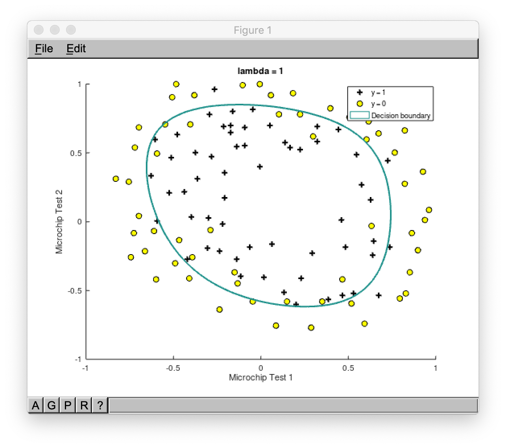

# Regresión lineal

**La regresión lineal** es un modelo lineal, por ejemplo, un modelo que asume una relación lineal entre las variables de entrada (_x_) y la variable de salida única (_y_). Más específicamente, esa variable de salida (_y_) se puede calcular a partir de una combinación lineal de las variables de entrada (_x_).

En la imagen de arriba hay un ejemplo de dependencia entre la variable de entrada _x_ y la variable de salida _y_. La línea roja en el gráfico anterior se conoce como la mejor línea recta de ajuste. Basándonos en los puntos de datos dados (ejemplos de entrenamiento), intentamos trazar una línea que modele los puntos de la mejor manera. En el escenario del mundo real normalmente tenemos más de una variable de entrada.

## Características (variables)

Cada ejemplo de capacitación consta de características (variables) que describen este ejemplo (es decir, el número de habitaciones, la plaza del apartamento, etc.)

_n_ - número de características

_Rn+1_ - vector de _n+1_ números reales

## Parámetros

Los parámetros de la hipótesis queremos que nuestro algoritmo aprenda para poder hacer predicciones (es decir, predecir el precio del apartamento).

## Hipótesis

La ecuación que obtiene características y parámetros como entrada y predice el valor como salida (es decir, predice el precio del apartamento según su tamaño y número de habitaciones).

Para mayor comodidad de la notación, defina _X0 = 1_

## Función de costo

Función que muestra la precisión de las predicciones de la hipótesis con el conjunto actual de parámetros.

_xi_ - de entrada (características) de _iénesimo_ ejemplo de entrenamiento

_yi_ - salida del _iénesimo_ ejemplo de entrenamiento

_m_ - número de ejemplos de entrenamiento

## Lote Gradiente Descenso

El descenso de gradiente es un algoritmo de optimización iterativo para encontrar el mínimo de una función de costo descrita anteriormente. Para encontrar el mínimo local de una función que utiliza el descenso de gradiente, uno toma pasos proporcionales al negativo del gradiente (o gradiente aproximado) de la función en el punto actual.

La imagen de abajo ilustra los pasos que tomamos al bajar la colina para encontrar el mínimo local.

La dirección del paso se define por la derivada de la función de costo en el punto actual.

Una vez que decidimos qué dirección debemos seguir, debemos decidir cuál es el tamaño del paso que debemos tomar.

Necesitamos actualizar simultáneamente  para _j = 0, 1, ..., n_

 - la velocidad de aprendizaje, la constante que define el tamaño del paso de descenso del degradado

 - _jésimo_ valor de la característica del _iésimo_ ejemplo de entrenamiento

 - entrada (características) de _ith_ ejemplo de entrenamiento

_yi_ - salida del _iésimo_ ejemplo de entrenamiento

_m_ - número de ejemplos de entrenamiento

_n_ - número de características

>Cuando usamos el término "lote" para el descenso de gradiente, significa que cada paso del descenso de gradiente usa **todos** los ejemplos de entrenamiento (como se puede ver en la fórmula anterior).

## Característica de escalado

Para que la regresión lineal y el algoritmo de descenso de gradiente funcionen correctamente, debemos asegurarnos de que las características estén en una escala similar.

Por ejemplo, la característica "tamaño del apartamento" (por ejemplo, 120 m2) es mucho más grande que la característica "número de habitaciones" (por ejemplo, 2).

Para escalar las características necesitamos hacer la **normalización media**.

 - _jésimo_ valor de la característica del _iésimo_ ejemplo de entrenamiento

 - valor promedio de _jésima_ característica en el conjunto de entrenamiento

 - El rango (_máximo - mínimo_) de la _jésima_ característica en el conjunto de entrenamiento.

## Regresión polinomial

Regresión polinómica es una forma de análisis de regresión en el que la relación entre la variable independiente _x_ y la variable dependiente _y_ se modela como un _nth_ polinomio grado en _x_.

Si bien la regresión polinómica ajusta un modelo no lineal a los datos, como un problema de estimación estadística es lineal, en el sentido de que la función de hipótesis es lineal en los parámetros desconocidos que se estiman a partir de los datos. Por esta razón, la regresión polinomial se considera un caso especial de regresión lineal múltiple.

Ejemplo de una regresión polinomial cúbica, que es un tipo de regresión lineal.

Puede formar una regresión polinomial agregando nuevas características polinomiales.

Por ejemplo, si el precio del apartamento es una dependencia no lineal de su tamaño, entonces puede agregar varias características nuevas relacionadas con el tamaño.

## Ecuación normal

Existe una solución de forma cerrada para la regresión lineal y se parece a lo siguiente:

El uso de esta fórmula no requiere ninguna función de escalado, y obtendrá una solución exacta en un cálculo: no hay "bucle hasta la convergencia" como en el descenso de gradiente.

## Regularización

### Problema de sobreajuste

Si tenemos demasiadas características, la hipótesis aprendida puede encajar muy bien con el conjunto de **entrenamiento**:

**Pero** puede fallar en generalizar a **nuevos** ejemplos (digamos, predecir los precios en un nuevo ejemplo de detección si los nuevos mensajes son spam).

### Solución a sobreajuste

Aquí hay un par de opciones que pueden abordarse:

- Reducir el número de características
    - Seleccionar manualmente qué características mantener
    - Algoritmo de selección de modelo
- Regularización
    - Mantenga todas las características, pero reduzca la magnitud / valores de los parámetros del modelo (thetas).
    - Funciona bien cuando tenemos muchas características, cada una de las cuales contribuye un poco a la predicción de _y_.

La regularización funciona agregando un parámetro de regularización a la **función de costo**:

> Tenga en cuenta que no debe regularizar el parámetro .

 - parámetro de regularización

En este caso, la fórmula de **descenso de gradiente** tendrá el siguiente aspecto:

## Archivos

- [demo.m](./demo.m) - secuencia de comandos de demostración de regresión lineal que carga datos de prueba y grafica predicciones de regresión lineal en modo consola.
- [linear_regression_train.m](./linear_regression_train.m) - algoritmo de regresión lineal.
- [hypothesis.m](./hypothesis.m) - función de hipótesis de regresión lineal.
- [cost_function.m](./cost_function.m) - función de costo de regresión lineal.
- [feature_normalize.m](./feature_normalize.m) - función que normaliza las características.
- [gradient_descent.m](./gradient_descent.m) - función que realiza el descenso de gradiente.
- [gradient_step.m](./gradient_step.m) - función que realiza solo un paso de descenso de gradiente.
- [house_prices.csv](./house_prices.csv) - conjunto de datos de capacitación de los precios de la vivienda (según el número de habitaciones y el tamaño de la casa).
- [normal_equation.m](./normal_equation.m) - función que realiza el cálculo alternativo de los parámetros del modelo usando la ecuación normal (evitando el descenso del gradiente).
- [linearregression.m](./linearregression.m) - archivo principal que debe ejecutar desde Octave/MatLab para usar el algoritmo desde el entorno grafico.
- [linearregression.fig](./linearregression.fig) - archivo que almacena los gráficos, que se utilizan para visualizar los datos.
- [printLR.m](./printLR.m) - archivo que contiene el formato de los resultados que imprime en los archivos .doc y .pdf.

### Visualizaciones de demostración

## References

- [Machine Learning en Coursera](https://www.coursera.org/learn/machine-learning)
- [Regresión lineal en Wikipedia](https://es.wikipedia.org/wiki/Regresi%C3%B3n_lineal)
- [Pendiente de descenso en Wikipedia (en ingles)](https://en.wikipedia.org/wiki/Gradient_descent)
- [Pendiente de descenso por Suryansh S. (en ingles)](https://hackernoon.com/gradient-descent-aynk-7cbe95a778da)
- [Sobreajuste en GeeksForGeeks (en ingles)](https://www.geeksforgeeks.org/underfitting-and-overfitting-in-machine-learning/)
