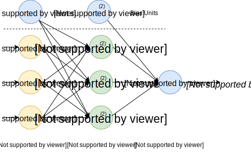
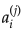
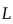
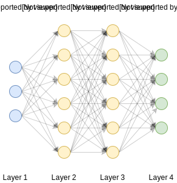
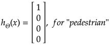
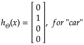
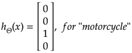
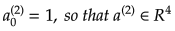
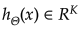
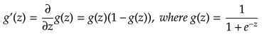

# Red neuronal

**Las redes neuronales artificiales** (ANN) o los sistemas conexionistas son sistemas informáticos vagamente inspirados en las redes neuronales biológicas que constituyen los cerebros de los animales. La red neuronal en sí no es un algoritmo, sino un marco para que muchos algoritmos de aprendizaje automático trabajen juntos y procesen entradas de datos complejos. Tales sistemas "aprenden" a realizar tareas considerando ejemplos, generalmente sin ser programados con ninguna regla específica de tareas.

Por ejemplo, en el **reconocimiento de imágenes**, pueden aprender a identificar imágenes que contienen gatos analizando imágenes de ejemplo que se han etiquetado manualmente como "gato" o "no gato" y usar los resultados para identificar gatos en otras imágenes. Lo hacen sin ningún conocimiento previo sobre los gatos, por ejemplo, que tienen pelaje, colas, bigotes y caras de gato. En su lugar, generan automáticamente características de identificación a partir del material de aprendizaje que procesan.

Una ANN se basa en una colección de unidades conectadas o nodos llamados **neuronas artificiales**, que modelan libremente las neuronas en un cerebro biológico. Cada conexión, como las sinapsis en un cerebro biológico, puede transmitir una señal de una neurona artificial a otra. Una neurona artificial que recibe una señal puede procesarla y luego señalar neuronas artificiales adicionales conectadas a ella.

En implementaciones de ANN comunes, la señal en una conexión entre neuronas artificiales es un número real, y la salida de cada neurona artificial se calcula mediante alguna función no lineal de la suma de sus entradas. Las conexiones entre las neuronas artificiales se llaman **aristas**. Las neuronas y los bordes artificiales suelen tener un **peso** que se ajusta a medida que avanza el aprendizaje. El peso aumenta o disminuye la intensidad de la señal en una conexión. Las neuronas artificiales pueden tener un umbral tal que la señal solo se envía si la señal agregada cruza ese umbral. Típicamente, las neuronas artificiales se agregan en capas. Diferentes capas pueden realizar diferentes tipos de transformaciones en sus entradas. Las señales viajan desde la primera capa (**la capa de entrada**), a la última capa (**la capa de salida**), posiblemente después de atravesar las **capas internas** varias veces.

## Modelo Neuron (Unidad Logística)

Aquí hay un modelo de una unidad de neurona.

Pesos:

## Modelo de red (Conjunto de neuronas)

La red neuronal consiste en las unidades neuronales descritas en la sección anterior.

Echemos un vistazo al modelo de ejemplo simple con una capa oculta.

 - "activación" de la unidad _i_ en la capa _j_.

 - matriz de pesos que controla la función de mapeo de la capa _j_ a la capa _j + 1_. Por ejemplo para la primera capa: .

 - Número total de capas en la red (3 en nuestro ejemplo).

 - Número de unidades (sin contar la unidad de polarización) en la capa _l_.

 - número de unidades de salida (1 en nuestro ejemplo, pero podría ser cualquier número real para la clasificación de varias clases).

## Clasificación Multi-clase

Con el fin de hacer que la red neuronal funcione con notificaciones de múltiples clases, podemos utilizar el enfoque de **uno contra todos**.

Let's say we want our network to distinguish if there is a _pedestrian_ or _car_ of _motorcycle_ or _truck_ is on the image.

Digamos que queremos que nuestra red distinga si hay un _peatón_ o un _automóvil_ de _motocicleta_ o _camión_ en la imagen.

En este caso, la capa de salida de nuestra red tendrá 4 unidades (la capa de entrada será mucho más grande y tendrá todos los píxeles de la imagen. Digamos que si todas nuestras imágenes serán 20x20 píxeles, entonces la capa de entrada tendrá 400 unidades cada una de los cuales contendrá el color blanco y negro de la imagen correspondiente).

En este caso, esperaríamos que nuestra hipótesis final tuviera los siguientes valores:

En este caso para el conjunto de entrenamiento:

Tendríamos:

## Propagación hacia adelante (o avance)

La propagación hacia adelante es un proceso interactivo de cálculo de activaciones para cada capa que comienza en la capa de entrada y va a la capa de salida.

Para la red simple mencionada en una sección anterior de arriba, podemos calcular las activaciones para la segunda capa según la capa de entrada y nuestros parámetros de red:

La activación de la capa de salida se calculará en función de las activaciones de la capa oculta:

Donde la función _g()_ puede ser un sigmoide:

### Implementación vectorizada de propagación hacia adelante

Ahora vamos a convertir los cálculos anteriores en una forma vectorizada más concisa.

Para simplificar las ecuaciones de activación anteriores, introduzcamos una variable _z_:

> No olvide agregar unidades de polarización (activaciones) antes de propagar a la siguiente capa. 
> 

### Ejemplo de propagación hacia adelante

Tomemos como ejemplo la siguiente arquitectura de red con 4 capas (capa de entrada, 2 capas ocultas y capa de salida):

En este caso, los pasos de propagación hacia adelante se verían como los siguientes:

## Función de costo

La función de costo para la red neuronal es bastante similar a la función de costo de regresión logística.

## Propagación Hacia Atrás

### Computación gradiente

El algoritmo de propagación hacia atrás tiene el mismo propósito que el descenso de gradiente para regresión lineal o logística: corrige los valores de thetas para minimizar una función de costo.

En otras palabras, necesitamos poder calcular la derivada parcial de la función de costo para cada theta.

Supongamos que:

 - "error" del nodo _j_ en la capa _l_.

Para cada unidad de salida (capa _L = 4_):

O en forma vectorizada:

 - gradiente sigmoideo.

Ahora podemos calcular el paso del gradiente:

### Algoritmo de contrapropagación

Para conjunto de entrenamiento

Necesitamos establecer:

## Inicialización Aleatoria

Antes de comenzar la propagación hacia adelante, necesitamos inicializar los parámetros de Theta. No podemos asignar cero a todos los thetas, ya que esto haría que nuestra red fuera inútil porque cada neurona de la capa aprenderá lo mismo que sus hermanos. En otras palabras, tenemos que **romper la simetría**. Para hacerlo necesitamos inicializar thetas a algunos valores iniciales aleatorios pequeños:

## Archivos

- [demo.m](./demo.m) - archivo de demostración que debe ejecutar para iniciar el entrenamiento de redes neuronales y para ver cómo la red reconocerá los dígitos escritos a mano en consola. 
- [neural_network_train.m](./neural_network_train.m) - función que inicializa la red neuronal y comienza su entrenamiento.
- [neural_network_predict.m](./neural_network_predict.m) - realiza la predicción de los datos de entrada utilizando parámetros de red capacitados.
- [debug_initialize_weights.m](./debug_initialize_weights.m) - función que inicializa las redes de red no aleatoriamente para fines de depuración.
- [debug_nn_gradients.m](./debug_nn_gradients.m) - función que ayuda a depurar gradientes de propagación hacia atrás comparándolos con gradientes calculados numéricamente.
- [debug_numerical_gradient.m](./debug_numerical_gradient.m) - calcula el gradiente numéricamente (usando el paso epsilon pequeño en cierto punto).
- [digits.mat](./digits.mat) - conjunto de entrenamiento de dígitos etiquetados a mano.
- [display_data.m](./display_data.m) - función auxiliar que procesa dígitos seleccionados al azar del conjunto de entrenamiento.
- [fmincg.m](./fmincg.m) - función que realiza pendiente de gradiente (alternativa a `fminunc()`).
- [nn_backpropagation.m](./nn_backpropagation.m) - función que realiza la propagación hacia atrás para la red neuronal.
- [nn_cost_function.m](./nn_cost_function.m) - función que calcula el costo de la red neuronal para parámetros específicos del modelo.
- [nn_feedforward_propagation.m](./nn_feedforward_propagation.m) - función que realiza la propagación de pasos hacia atras para la red neuronal.
- [nn_gradient_step.m](./nn_gradient_step.m) - función que realiza un paso de gradiente.
- [nn_params_init.m](./nn_params_init.m) - inicializa aleatoriamente los parámetros de la red neuronal para frenar la simetría.
- [nn_params_roll.m](./nn_params_roll.m) - función que transforma el vector plano de thetas en matrices de thetas para cada capa NN.
- [sigmoid_gradient.m](./sigmoid_gradient.m) - calcula el gradiente de la función sigmoide.
- [sigmoid.m](./sigmoid.m) - función sigmoidea.
- [unroll.m](./unroll.m) - transforma matrices de theta para cada capa en un vector plano.
- [RedNeuronal.m](./RedNeuronal.m) - archivo principal que debe ejecutar desde Octave/MatLab para usar el algoritmo desde el entorno grafico.
- [RedNeuronal.fig](./RedNeuronal.fig) - archivo que almacena los gráficos, que se utilizan para visualizar los datos.

### Visualizaciones de demostración

## Referencias

- [Machine Learning en Coursera](https://www.coursera.org/learn/machine-learning)
- [Pero, ¿qué es una red neuronal? Por 3Blue1Brown (Ingles, subtitulos español)](https://www.youtube.com/watch?v=aircAruvnKk)
- [Red neuronal en Wikipedia](https://es.wikipedia.org/wiki/Red_neuronal_artificial)
- [TensorFlow Neural Network Playground](https://playground.tensorflow.org/)
- [Aprendizaje profundo por la Universidad Carnegie Mellon (Ingles)](https://insights.sei.cmu.edu/sei_blog/2018/02/deep-learning-going-deeper-toward-meaningful-patterns-in-complex-data.html)
